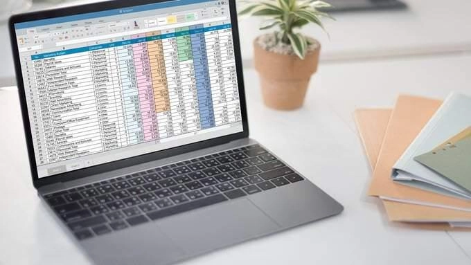
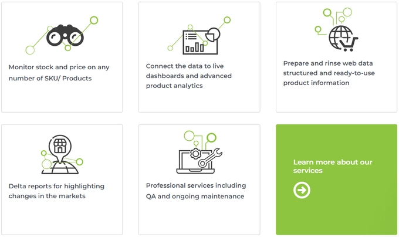
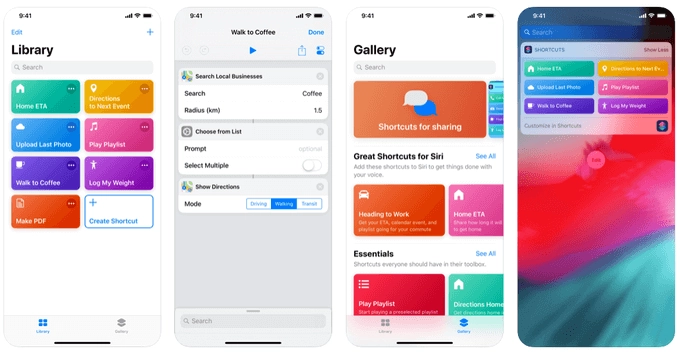
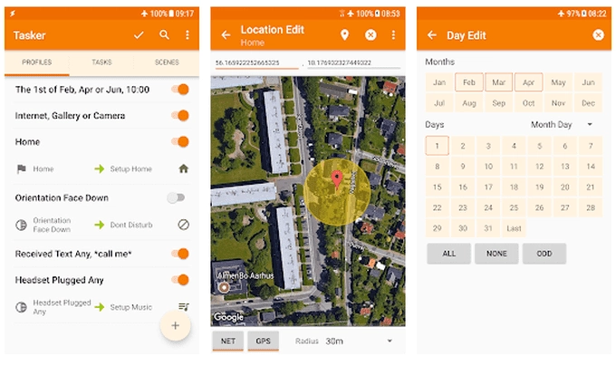

# How To Scrape Websites: From Beginner-Friendly Tools to Advanced Techniques

---

Ever wonder how companies always seem to know what you're browsing, what you're buying, or what trends are hot right now? They're scraping the web. And honestly, if they're doing it, why shouldn't you?

Learning web scraping isn't just for tech wizards anymore. Whether you're hunting for the best deals, building a lead list for your business, or even job hunting, knowing how to pull data from websites gives you a real edge. Below, we'll walk through methods ranging from "I just installed Chrome yesterday" to "I write Python in my sleep."

---

## The "I Don't Want to Code Anything" Route: Web Scraping Services

Look, not everyone wants to mess with code. Some of us just want the data without the headache. That's where professional scraping services come in.

For heavy-duty operations, **Scrapinghub** handles large-scale data collection without you lifting a finger. They've got the infrastructure, you've got the data needs—it's a match made in efficiency heaven.

If you're thinking smaller scale, **ParseHub** is your friend. They start everyone off with a free 200-page plan (no credit card gymnastics required), and you can scale up later if you need more firepower. It's basically the "try before you buy" approach, which is refreshing in a world where everything wants your payment info upfront.

---

## The Chrome Extension That Actually Works: Web Scraper

For quick jobs that don't require server farms or PhD-level coding, the **Web Scraper Chrome Extension** is legitimately solid.

Sure, there's a bit of a learning curve—like figuring out which button does what on your new microwave—but the documentation and tutorial videos are actually helpful (rare praise, I know). Once you get the hang of it, you're collecting data faster than you can say "why didn't I do this sooner?"

The best part? The free tier offers more than most paid tools. It's perfect for those "I need this data by tomorrow morning" moments without opening your wallet.

---

## Yes, Excel Can Scrape Websites (No, Really)

Microsoft Excel isn't just for endless spreadsheets and pivot tables that make your eyes glaze over. It's got a built-in web scraping feature that's surprisingly capable.

Open Excel, hit the **Data** tab, click **From Web**, and follow the wizard. It's almost too easy. The data flows right into your spreadsheet where you can manipulate it to your heart's content.

This method works great for straightforward data collection when you need something simple and don't want to learn a new tool. Sometimes the old reliable options are reliable for a reason.

---

## For the Python Folks: Scrapy and Beautiful Soup

If you speak Python (even just a little), you've got options that'll make other developers jealous.

**Scrapy** is the heavyweight champion here. You set up custom "spiders" that crawl websites and extract exactly what you need. The tutorial takes you from "what's a spider?" to "I'm running scheduled multi-spider operations" without making you feel stupid.

Bonus: Scrapy skills are in serious demand. Companies pay good money for developers who can wrangle data like this. It's not just a useful personal tool—it could literally become your career.

**Beautiful Soup** is Scrapy's older, slightly friendlier cousin. It's been around longer and many people find it easier to wrap their heads around. 👉 [Discover how professional scraping tools handle complex data extraction at scale](https://www.scraperapi.com/?fp_ref=coupons)

It doesn't have every bell and whistle that Scrapy offers, but for most real-world use cases, it hits the sweet spot between "powerful enough" and "I actually understand what I'm doing."

---

## APIs: Let Someone Else's Server Do the Heavy Lifting

Writing your own scraping code is cool and all, but running it locally eats bandwidth like a teenager eats snacks. As your operation scales up, you'll feel it.

Web scraping APIs solve this by offloading the work to remote servers. You write the code, they handle the infrastructure.

**Dexi** is the fully-loaded option with professional pricing to match. **ScraperAPI** strips things down to the essentials and costs less. They even give you 1,000 free API calls to test drive before asking for money, which is more generous than your average free trial.

The beauty here is that you get the power of custom code without your computer sounding like it's preparing for takeoff every time you run a scrape job.

---

## IFTTT: The "Set It and Forget It" Approach

**IFTTT** (If This Then That) automates basically anything, including web scraping. It's like having a personal assistant who never sleeps and never complains.

Let's say you want to track tweets about a topic. Set up an applet that captures tweets matching your search term, grabs the username and timestamp, and dumps it all into a Google Sheet. Done. Now it runs automatically while you're doing literally anything else.

The real magic is how many services IFTTT connects to. Twitter, Instagram, Reddit, email, calendar, smart home devices—if it's online, IFTTT probably talks to it. For simple data collection tasks, this might be the most elegant solution available.

---

## iOS Users: Shortcuts App Gets Weird (in a Good Way)

The **Shortcuts** app on iOS is capable of way more than most people realize. Sure, it'll route you to appointments and text your mom—but it can also scrape websites.

Using regular expressions (regex) with Shortcuts lets you pull very specific data from websites with precision. It's like using a scalpel instead of a shovel. One Reddit user even wrote a detailed guide on combining regex with Shortcuts to extract exactly what you need from web pages.

Is it the most intuitive thing you'll ever do? Not exactly. But once you've got it set up, you're pulling data on your phone with the tap of a button. That's pretty satisfying.

---

## Android Users: Tasker Is Your Swiss Army Knife

Android doesn't have a built-in scraping solution like iOS does, but **Tasker** fills that gap admirably.

Tasker is an automation app that can do basically anything on your phone—including web scraping tasks. It's more complex than IFTTT but also more powerful. Think of it as the difference between a basic point-and-shoot camera and a DSLR with manual controls.

The learning curve is real, but the payoff is an automation system that can handle tasks other apps can't touch. For Android users serious about data collection, it's worth the investment of time.

---

## The Bottom Line

Web scraping isn't some mystical dark art reserved for data scientists in hoodies. It's a practical skill that ranges from "click a few buttons" to "write custom code," depending on your needs and comfort level.

Start simple. Try the Chrome extension or Excel if you're just dipping your toes in. Scale up to Python libraries or APIs when you're ready for more control. Or just use IFTTT and let automation do the work while you sleep.

The data you collect—once you've sorted it properly—gives you insights that would take forever to gather manually. That's the real value here. Whether you're tracking prices, monitoring trends, or building business intelligence, 👉 [see why ScraperAPI is built specifically for scalable, reliable web data extraction](https://www.scraperapi.com/?fp_ref=coupons) when you're ready to level up your data game.
